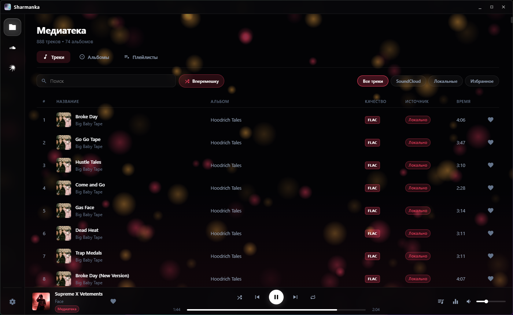
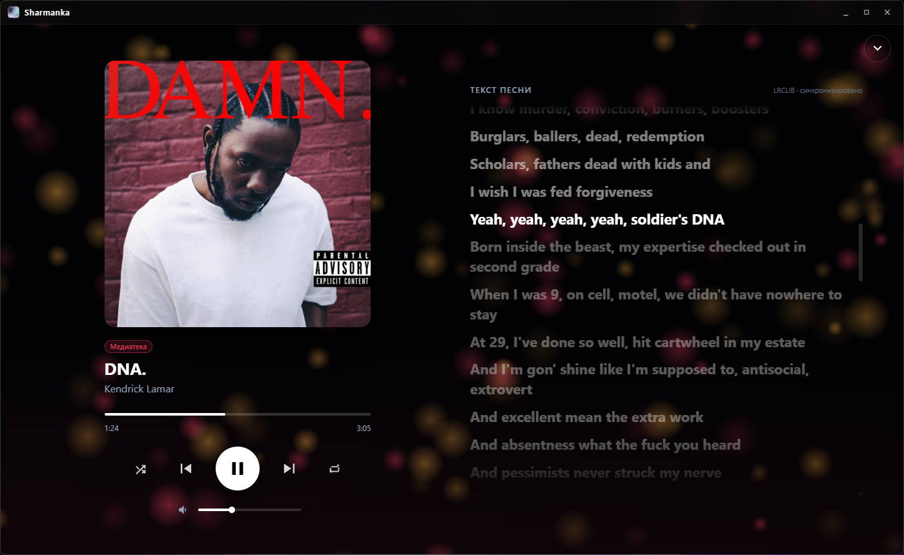
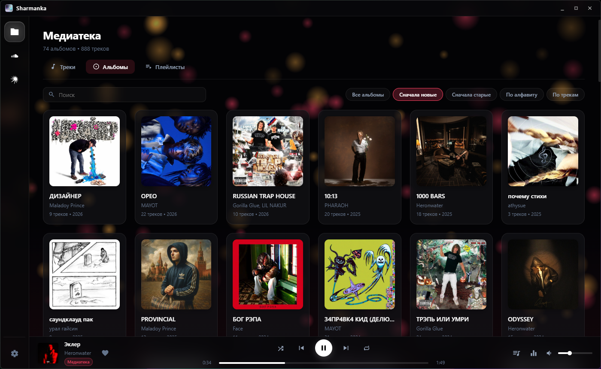
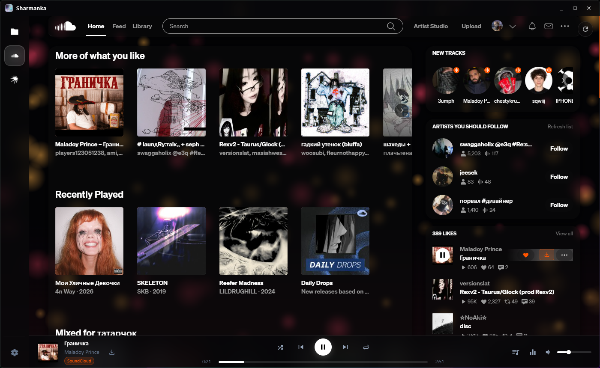
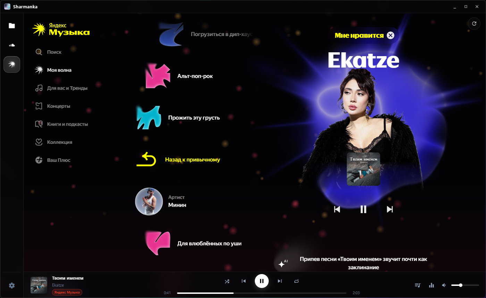

<div align="center">


# Sharmanka

**Вся музыка в одном плеере** — локальная медиатека, SoundCloud и Яндекс Музыка в одном окне.

Windows 10 / 11 · x64 · Electron

</div>



## Возможности

- **Несколько сервисов в одном окне.** SoundCloud и Яндекс Музыка открываются внутри приложения с вашим аккаунтом, рядом с локальной медиатекой. Переключение — одним кликом, без потери места в треке.
- **Общий плеер.** Одна панель управления, очередь, громкость и эквалайзер для всех источников.
- **Медиатека.** Треки, альбомы и плейлисты из ваших папок; качество файла (FLAC, MP3 с битрейтом), избранное, редактирование тегов и обложек, автоматический поиск недостающих обложек.
- **Свой сервер.** Подключение папки с музыкой по WebDAV (например, `rclone serve webdav`) — треки играют по сети без копирования на компьютер.
- **10-полосный эквалайзер** с пресетами — работает и для файлов, и для SoundCloud, и для Яндекс Музыки.
- **Полноэкранный режим** с большой обложкой и синхронизированным текстом песни (LRCLIB).
- **Мини-плеер** поверх окон при сворачивании: выбор угла и монитора, клик по обложке возвращает приложение.
- **Скачивание из SoundCloud** прямо в медиатеку.
- **Очередь** с историей прослушанного и режимом «Вперемешку» — для всех источников.
- **Внешний вид:** своя картинка или GIF на фоне, анимации под ритм музыки (пульс, волны, частицы, спектр, аура), цвет интерфейса из обложки.
- **Прокси** отдельно для SoundCloud и Яндекс Музыки (SOCKS5 / SOCKS4 / HTTP) с проверкой соединения.
- Встроенная блокировка рекламы и трекеров.

| Полный экран с текстом | Альбомы |
|---|---|
|  |  |
| **SoundCloud** | **Яндекс Музыка** |
|  |  |

## Установка

Скачайте последнюю версию на странице [Releases](../../releases):

- `Sharmanka Setup x.y.z.exe` — установщик;
- `Sharmanka x.y.z.exe` — портативная версия без установки.

Если Windows покажет предупреждение SmartScreen, нажмите «Подробнее» → «Выполнить в любом случае».

## Запуск из исходников

Нужен [Node.js](https://nodejs.org/) 20 или новее.

```bash
npm install
npm start
```

Приложение использует сборку Electron от [castlabs](https://github.com/castlabs/electron-releases) с поддержкой Widevine — она нужна для воспроизведения защищённого контента в веб-сервисах. `npm install` скачает её автоматически.

### Сборка установщика

```bash
npm run build
```

Готовые файлы появятся в папке `dist/`: установщик NSIS и портативный exe.

## Структура проекта

```
main.js                  главный процесс Electron: окна, IPC, сессии сервисов
preload.js               API для интерфейса (contextBridge)
overlay-preload.js       API для мини-плеера
src/main/                медиатека, WebDAV, прокси, обложки, тексты, скачивание SoundCloud
src/renderer/            интерфейс приложения (HTML / CSS / JS)
src/injected/            скрипты и стили, встраиваемые в SoundCloud и Яндекс Музыку
```

Настройки и данные хранятся в `%APPDATA%\Sharmanka`. Пароль от сервера шифруется средствами системы (`safeStorage`).

## Благодарности

- [BetterSoundCloud](https://github.com/AlirezaKJ/BetterSoundCloud) — основа тем оформления SoundCloud (MIT).
- [LRCLIB](https://lrclib.net) — синхронизированные тексты песен.
- [Deezer](https://www.deezer.com) и [iTunes Search API](https://performance-partners.apple.com/search-api) — поиск обложек.
- [@cliqz/adblocker](https://github.com/ghostery/adblocker) — блокировка рекламы.
- [music-metadata](https://github.com/Borewit/music-metadata) — чтение тегов.

## Лицензия

[MIT](LICENSE).

Sharmanka — неофициальное приложение и не связано с SoundCloud или Яндексом. SoundCloud и Яндекс Музыка — товарные знаки их владельцев. Для прослушивания сервисов используются ваши собственные аккаунты и подписки.
